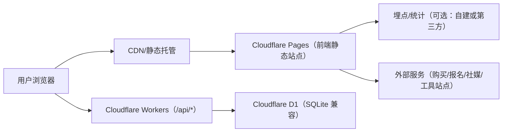
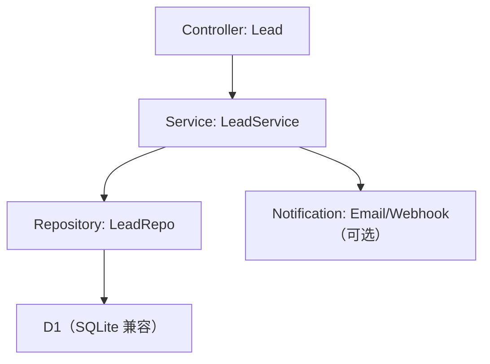
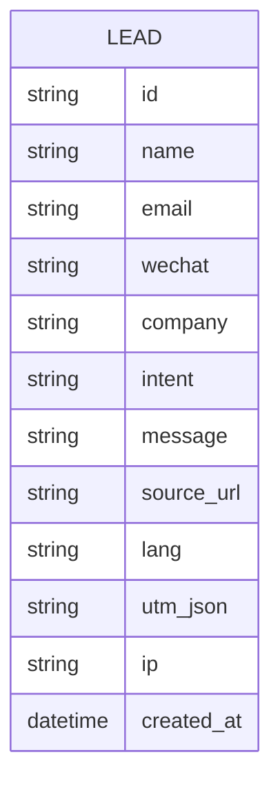

## 1. 架构设计


## 2. 技术选型说明
- 前端：React@18 + TypeScript + tailwindcss@3 + vite
- 路由：react-router（若启用内容中心/详情页）
- 内容：MD/MDX 或本地 JSON 数据源（MVP），后续可接 CMS
- 动效：CSS 动效为主（prefers-reduced-motion 适配）；必要时引入轻量动画库（以现有依赖为准）
- 部署：Cloudflare Pages（前端）+ Cloudflare Workers（API）+ HTTPS；支持自定义域名 58begin.com
- 数据：MVP 不做账号体系；“成交/支付”通过外部平台承接；“线索表单”写入 D1 并可选 webhook 通知

## 3. 路由定义（推荐）
| 路由 | 用途 |
|---|---|
| / | 首页长滚动（核心转化页） |
| /posts | 内容中心（列表/筛选） |
| /posts/:slug | 内容详情页（阅读体验/相关阅读/分享） |
| /privacy | 隐私政策/合规说明 |

## 4. API 定义（仅在启用表单/回传时需要）
### 4.1 提交联系表单（可选）
- Method：POST /api/lead
- Request（TypeScript）
```ts
export type LeadCreateRequest = {
  name?: string;
  email?: string;
  wechat?: string;
  company?: string;
  intent: "course" | "consulting" | "partnership" | "other";
  message?: string;
  sourceUrl: string;
  utm?: Record<string, string | undefined>;
  lang: "zh" | "en";
};
```
- Response
```ts
export type LeadCreateResponse =
  | { ok: true; id: string }
  | { ok: false; code: "INVALID" | "RATE_LIMIT" | "SERVER_ERROR" };
```
- 约束：前端需做基础校验；服务端需做频率限制与反垃圾（例如 honeypot 字段 + 简单 IP 限流）。

## 5. 服务端架构图（若启用自建 API）


## 6. 数据模型（若启用线索收集）
### 6.1 ER 图


### 6.2 DDL（示例）
```sql
CREATE TABLE IF NOT EXISTS lead (
  id TEXT PRIMARY KEY,
  name TEXT,
  email TEXT,
  wechat TEXT,
  company TEXT,
  intent TEXT NOT NULL,
  message TEXT,
  source_url TEXT NOT NULL,
  lang TEXT NOT NULL,
  utm_json TEXT,
  ip TEXT,
  created_at TEXT NOT NULL
);
CREATE INDEX IF NOT EXISTS idx_lead_created_at ON lead(created_at);
CREATE INDEX IF NOT EXISTS idx_lead_ip_created_at ON lead(ip, created_at);
```

## 7. 前端工程规范（与 PRD 的可落地性对齐）
- 组件分层：页面（pages）/区块（sections）/基础组件（ui）/数据配置（content）
- 内容配置：中英两份结构一致的数据文件，运行时按语言选择；对关键字段做 schema 校验（可选）
- 性能策略：图片压缩与多尺寸；字体子集化；按路由拆包；懒加载长列表与大图
- SEO：Helmet 管理 meta；生成 sitemap.xml；OpenGraph 完整；规范化 URL
- 监控与埋点：统一封装 track()；事件命名与属性字段与 PRD 对齐；支持关闭埋点开关

## 8. 部署与运维要求
- 域名：58begin.com（含 www/非 www 统一重定向）
- HTTPS：强制启用；HSTS（可选）
- Pages：静态资源长缓存 + hash；路由回退（_redirects）；安全头（_headers）
- Workers：/api/* 路由；可观测（错误率/延迟）与版本回滚（Versions）
- 监控：基础可用性监控 + Web Vitals 监控（可选）
