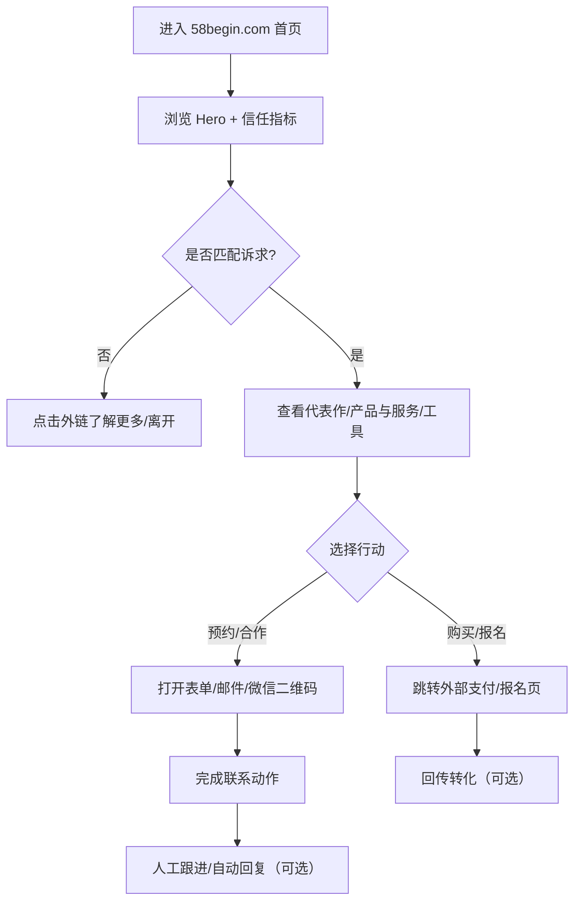

## 1. 产品概述
58begin.com 是一个以「个人品牌/创作者/创业者」为核心定位的官网，用于集中呈现：身份与可信背书、代表作与内容资产、产品与服务矩阵、工具与项目展示、对外合作与联系入口，并形成可衡量的转化漏斗。
- 解决的问题：用户难以在碎片化平台中快速理解“58begin是谁/做什么/能提供什么价值/如何联系”；品牌方难以快速评估合作匹配度并完成触达。
- 目标价值：提升品牌可信度与专业形象；沉淀长期可复用的内容与产品入口；为课程/服务/工具/合作带来稳定线索与转化。

## 2. 产品定位与成功标准
### 2.1 核心定位（对标 kellypeng.com 的信息架构与表达方式）
- 页面形态：桌面端优先的一页式长滚动（Hero → 信任指标 → About → Featured → Find Me → Products & Services → Tools → Contact），移动端为汉堡菜单 + 锚点跳转。
- 叙事方式：先建立“我是谁/我值得信任”的强叙事，再用“代表作/产品/工具”完成价值证明，最后给出“联系/合作/购买/订阅”等明确 CTA。
- 内容呈现：信息密度高但层级清晰（大标题 + 简短副标题 + 指标卡 + 模块化卡片列表），支持中英切换。

### 2.2 北极星指标（NSM）
- NSM：有效线索数/周（完成“预约/合作意向提交/加微信/邮件发送”任一关键动作的人数）

### 2.3 关键指标（KPI）
- 品牌认知：首页停留时长、滚动深度、模块曝光率（Section View）
- 转化：CTA 点击率、联系成功率（复制邮箱/打开邮件/下载资料/跳转购买）
- 内容资产：内容页访问、文章阅读完成率、外部平台导流点击
- 体验质量：LCP、CLS、INP、可访问性分数（Lighthouse）

## 3. 用户画像与使用场景
### 3.1 用户画像
| 画像 | 目标 | 主要痛点 | 关注信息 | 关键行为 |
|---|---|---|---|---|
| 潜在用户/学员/客户 | 判断是否值得关注与购买 | 不确定你是否专业、是否适合我 | 你是谁、做过什么、能带来什么结果、产品如何开始 | 阅读 About/代表作 → 点击产品/预约/购买 |
| 商务合作方/品牌方 | 评估合作匹配度并快速联系 | 找不到清晰的合作方式与人群画像 | 受众画像、覆盖渠道、合作形式、联系入口 | 查看合作信息 → 下载合作资料/发邮件 |
| 同行/媒体/招聘/投资人 | 快速建立信任、获取背景资料 | 信息分散、不成体系 | 背景经历、成果指标、项目案例、媒体报道 | 浏览指标与案例 → 收藏/分享 |
| 社媒粉丝回访 | 找到“全集合入口”与最新动态 | 多平台跳转成本高 | 你在哪些平台、最新内容与产品 | 点击外链 → 关注/订阅 |

### 3.2 典型场景
- 场景 A（粉丝回访）：从短视频/社媒 bio 进入 → 30 秒内理解定位 → 点击产品或工具。
- 场景 B（购买决策）：在外部内容看到你 → 搜索官网 → 查看代表作与指标 → 跳转购买/预约。
- 场景 C（商务合作）：品牌方确认受众与合作方式 → 直接邮件或提交合作表单 → 留下信息。

## 4. 核心功能
### 4.1 用户角色（本期不做登录）
本期默认无登录体系，所有内容可公开访问；转化行为以外链跳转或表单/邮件收集为主。

### 4.2 功能模块清单（MVP）
1. **首页（长滚动单页）**：品牌叙事 + 指标背书 + 模块化卡片列表 + CTA 转化。
2. **内容中心（可选，但推荐）**：沉淀文章/案例/播客文字稿，支持 SEO 与长期增长。
3. **内容详情页（可选，但推荐）**：结构化阅读体验、目录锚点、相关阅读。
4. **合规页面**：隐私政策/免责声明（若有表单收集或 Cookie）。

### 4.3 页面明细（模块定义到可交付）
| 页面名称 | 模块名称 | 功能描述（验收口径） |
|---|---|---|
| 首页 | 顶部导航 | 左侧 Logo/站名“58begin”，右侧语言切换（中/EN）+ 菜单按钮；滚动时保持可见；点击菜单展开锚点列表。 |
| 首页 | Hero 头屏 | 大标题（身份/一句话价值主张）+ 1–2 行简介 + 主 CTA（例如“了解产品/预约咨询”）+ 次 CTA（例如“查看代表作/订阅邮件”）。 |
| 首页 | 信任指标 | 3–6 个数字指标卡（如“累计学员/付费用户/项目数/全网粉丝/媒体报道/满意度”）；支持后台配置；带轻量动效（进入视口数字渐显/计数）。 |
| 首页 | 关于我/关于58begin | 300–600 字叙事文案 + 关键经历列表（时间线或 bullet）；配头像/品牌视觉。 |
| 首页 | 代表作 Featured | 1–3 个代表作卡片（书/课程/报告/旗舰产品），包含标题、摘要、结果指标、主 CTA（购买/报名/了解更多）。 |
| 首页 | 内容入口 Find Me On | 社媒渠道矩阵（图标 + 名称 + 箭头），默认新标签打开；可配置渠道与排序；支持“复制链接”。 |
| 首页 | 产品与服务 | 分为“课程项目/咨询服务/商务合作”等分组，每个分组 2–6 张卡片；卡片包含：名称、适用人群、你提供的结果、开始方式 CTA（报名/预约/发邮件）。 |
| 首页 | 工具/项目 AI Tools | 展示自研工具/开源项目/小应用：名称、类型标签（Web App/Chrome 插件/Mac App 等）、一句话价值、链接、截图缩略图；支持“置顶/排序”。 |
| 首页 | 联系我 Contact | 展示联系选项：微信二维码（可点击放大）、邮箱（可一键复制）、商务合作表单入口（可选）、常见问题（可选）。 |
| 内容中心 | 列表/筛选 | 按类型（文章/案例/播客稿/清单）过滤；支持标签；默认按发布时间倒序；每条显示标题、摘要、阅读时长、发布时间。 |
| 内容详情 | 阅读体验 | 支持目录（TOC）锚点、代码/引用样式、相关阅读 3 条、分享按钮（复制链接）。 |
| 合规 | 隐私政策 | 若启用埋点/表单/订阅，必须展示数据收集范围、用途、保存期限、用户权利与联系邮箱。 |

### 4.4 关键交互逻辑（对标 kellypeng.com）
- 语言切换：全站内容中英版本一键切换；保持当前滚动位置；记录用户偏好（localStorage）。
- 菜单交互：移动端汉堡菜单展开后提供锚点按钮（About/Featured/Content/Products/Tools/Contact）；点击后平滑滚动并自动收起菜单。
- 滚动引导：模块进入视口时高亮当前锚点（可选）；重要 CTA 在首屏与中段重复出现。
- 外链一致性：所有外链新标签打开；在离站前埋点记录；必要时做“离站提示”（非强制）。
- 无障碍：键盘可达、聚焦态清晰、对比度达标、图片有替代文本。

## 5. 核心业务流程
### 5.1 主流程（从访问到转化）
1) 用户从社媒/搜索进入首页 → 2) 30 秒内完成定位认知（Hero + 指标 + About） → 3) 进入代表作/产品/工具模块 → 4) 点击 CTA（购买/报名/预约/邮件/加微信） → 5) 进入外部落地页或完成联系动作。

### 5.2 内容增长流程（可选）
发布内容 → 内容被搜索/分享 → 进入内容详情 → 引导至产品/订阅 → 形成复访。

## 6. 页面布局与视觉规范
### 6.1 视觉设计方向（参考站点的整体风格，但形成 58begin 的独特气质）
- 总体气质：克制的“编辑部/杂志感”排版 + 强对比大标题；强调可信与专业，避免花哨科技风。
- 版式：大字号标题 + 窄列正文（提升阅读舒适度）+ 模块化卡片（工具/产品/渠道）。
- 动效：以“进入视口渐显/错峰上浮”“hover 提示与微位移”为主；避免重型大动画影响加载。

### 6.2 基础样式规范（可落地到组件）
| 类别 | 规范 |
|---|---|
| 栅格 | 桌面端内容最大宽度 1080–1200px；正文窄列 680–760px；两列/三列卡片栅格在 1024px+ 生效。 |
| 间距 | 模块间垂直间距 72–120px（视密度）；模块内 16/24/32px 递进。 |
| 字体层级 | H1 48–64px；H2 28–36px；正文 16–18px；强调信息用 12–14px 小字标签。 |
| 颜色 | 1 个主色（用于 CTA/强调）+ 中性色（背景/文字）+ 1 个点缀色（用于标签/链接）；对比度 AA。 |
| 卡片 | 轻边框或细阴影 + 8–16px 圆角；hover 时边框/背景轻变化 + 2–4px 上浮。 |
| 图标 | 统一风格（线性或扁平二选一）；社媒可用 emoji/品牌 icon，但需一致尺寸与对齐。 |
| 图片 | 头像/封面统一比例（头像 1:1 或 4:5；工具缩略图 16:9）；默认懒加载。 |

### 6.3 响应式规范
- 桌面端优先；移动端重点保证：首屏信息不拥挤、CTA 易点击、菜单可快速跳转。
- 断点建议：≤480（小屏）、481–768（手机）、769–1024（平板）、≥1025（桌面）。

## 7. 内容结构与后台配置（MVP 可用“配置文件”替代后台）
### 7.1 配置项（无需登录后台的可运营能力）
- 站点信息：名称、主标题、副标题、头像、简介、CTA 文案与链接、中英文案。
- 指标卡：标题、数值、单位、备注（可选）、显示/隐藏。
- 渠道矩阵：平台名称、链接、icon、显示/隐藏、排序。
- 代表作：标题、摘要、图片、CTA、结果指标（可选）。
- 产品与服务：分组名称、卡片字段（适用人群/结果/CTA/标签）。
- 工具：名称、类型、描述、链接、缩略图、置顶。
- 联系方式：邮箱、微信二维码、合作表单 URL（可选）。

## 8. 技术实现要求（面向落地交付）
### 8.1 非功能性要求
- 性能：LCP < 2.5s（移动端 4G 目标）；CLS < 0.1；图片/字体按需加载。
- SEO：关键页面可被索引；标题/描述可配置；OpenGraph 完整；站点地图与 robots.txt。
- 可访问性：语义化标签、可聚焦、对比度达标、图片 alt 文本、Reduced Motion 支持。
- 安全：所有外链使用 rel="noopener noreferrer"；表单防 spam（如启用表单）。

### 8.2 技术边界（MVP）
- 默认不做账号系统、支付系统、站内复杂搜索；支付/报名通过外部平台承接。
- 内容中心采用本地内容文件（MD/MDX）或简易 JSON 数据源；后续可接入 CMS。

## 9. 用户体验优化标准（验收清单）
- 信息清晰：首屏 10 秒内看懂“你是谁/对谁有用/下一步做什么”。
- CTA 明确：每个模块至少 1 个明确动作；同一页面 CTA 样式一致。
- 可信背书：指标卡/代表作必须可核验或可解释（避免夸大）；合作模块给出受众画像与合作方式。
- 阅读舒适：正文行宽控制、行高合理、段落间距清晰；长内容支持目录与回到顶部。
- 交互一致：hover/active/focus 状态齐全；空态/无数据状态可用。

## 10. 数据埋点规划（MVP 版）
### 10.1 事件列表（Event）
| 事件名 | 触发时机 | 关键属性（Properties） |
|---|---|---|
| page_view | 页面加载完成 | url, referrer, lang, device, utm_* |
| language_switch | 切换中/EN | from_lang, to_lang |
| menu_toggle | 打开/关闭菜单 | action(open/close), device |
| section_view | 模块进入视口 | section_id, section_name |
| cta_click | 点击任一 CTA | cta_id, cta_text, section, target_url, is_external |
| social_click | 点击渠道矩阵 | platform, target_url |
| product_card_click | 点击产品卡 | product_id, product_name |
| tool_card_click | 点击工具卡 | tool_id, tool_name, tool_type |
| contact_copy_email | 点击复制邮箱 | email_domain |
| contact_qr_zoom | 放大微信二维码 | source(section) |
| outbound_redirect | 离站跳转（可选） | target_domain, target_url |

### 10.2 漏斗（Funnel）
Landing（page_view） → 关键模块曝光（section_view: products/tools/featured） → 行动点击（cta_click） → 联系完成（contact_copy_email/表单成功）或外部成交（如可回传）。

## 11. 项目排期与资源配置（建议方案）
### 11.1 里程碑
| 阶段 | 产出物 | 验收标准 |
|---|---|---|
| 需求与内容准备 | PRD、信息架构、文案清单、素材清单 | 模块字段完整、文案可直接上站 |
| 视觉与交互设计 | 关键页面视觉稿（桌面/移动）、组件规范 | 样式规范可落地、交互状态齐全 |
| 前端开发（MVP） | 首页 + 可选内容中心 + 埋点 | Lighthouse/可访问性达标，事件可上报 |
| 联调与测试 | 兼容性/性能/SEO 检查报告 | 主流浏览器/移动端正常 |
| 上线 | 域名/HTTPS/缓存策略/监控 | 可回滚、可观测、指标可看 |
| 运营迭代 | A/B 方案、内容节奏、转化优化 | 按数据驱动优化 |

### 11.2 人员与职责（最小可行团队）
| 角色 | 投入 | 主要职责 |
|---|---|---|
| 产品/项目负责人（PM） | 1 | 定位、信息架构、PRD、里程碑推进、验收 |
| 视觉/交互设计（Design） | 1 | 视觉语言、组件规范、关键页面稿、动效建议 |
| 前端工程师（FE） | 1 | 架构实现、页面开发、性能与可访问性、埋点接入 |
| 内容编辑/运营（可兼职） | 0.5 | 文案打磨、内容发布、素材维护 |
| 后端/数据（可选） | 0–0.5 | 若启用表单/回传/CRM，对接与数据管道 |

## 12. 上线后的迭代方向（Roadmap）
### 12.1 优先迭代（P1）
- 内容中心完善：标签体系、推荐逻辑、订阅引导（邮件/公众号/社群）。
- 转化增强：预约日程（Calendly 类）或合作表单 + 自动邮件回复（可选）。
- 合作资料包：媒体资源页（Media Kit）+ 可下载 PDF（可选）。

### 12.2 增长与商业化（P2）
- 轻量 CMS：接入 Notion/Contentful/自建 CMS 以支持非技术运营。
- SEO 体系：专题页（Topic Hub）、结构化数据（JSON-LD）。
- 受众分层：面向不同人群的入口（学员/客户/合作方）与 CTA 个性化。

### 12.3 数据驱动优化（P3）
- 模块级 A/B：Hero 文案、CTA 样式、代表作顺序、指标卡文案。
- 漏斗优化：离站回流机制（订阅/资料领取）、转化归因（UTM/渠道）。

## 13. 待确认信息（不阻塞 PRD 交付，但影响最终文案与转化）
- 58begin 的主体身份与核心价值主张（一句话定位）与中英版本。
- 指标卡真实可用数据（粉丝数/项目数/学员数/评分等）与可公开范围。
- 代表作/产品/工具的清单、链接、素材（封面/截图）与主 CTA。
- 联系方式偏好：邮箱/微信/表单/日程预约是否启用。
