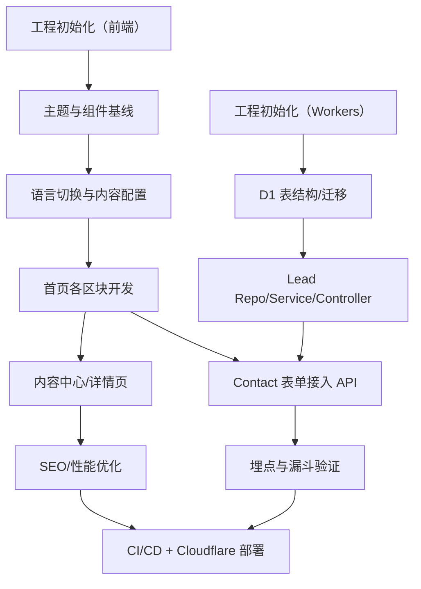

## 1. Roadmap 总览
本 Roadmap 以 PRD（功能/非功能/边界）为准，以技术架构说明为实现基线，并结合部署形态（Cloudflare Pages + Workers + D1）给出可落地的模块拆解、依赖关系与交付节点。

### 1.1 交付范围（MVP）
- 前端：一页式官网（长滚动）+ 中英切换 + 内容中心（/posts）+ 内容详情（/posts/:slug）+ 隐私政策（/privacy）
- 后端：线索表单 API（POST /api/lead）+ D1 数据库存储 + 基础反垃圾与限流
- 数据：站点内容采用本地配置（中/英两份），内容文章采用本地 Markdown（可扩展为 MDX）
- 埋点：按 PRD 的事件体系实现统一 track()，可切换 Provider（默认先本地/Console，生产按环境变量切第三方）
- 工程：本地开发/测试环境标准化、CI（GitHub Actions）、Cloudflare 部署配置与交付文档

### 1.2 不在本期范围（与 PRD 边界一致）
- 账号体系、站内支付、站内复杂搜索
- 站内“订单/学员/付费用户”管理后台
- 深度营销自动化（仅预留 webhook/邮件通知接口位）

## 2. 模块拆解与开发顺序
### 2.1 前端模块（按依赖顺序）
1) **基础工程与样式系统**
   - Tailwind 主题 Token、字体与排版基线、容器与栅格、可访问性基线（focus/对比度/Reduced Motion）
2) **全局能力**
   - 路由（/、/posts、/posts/:slug、/privacy）
   - 语言切换（zh/en）+ 持久化（localStorage）+ 文案数据源映射
   - 统一埋点 track() 封装（先实现接口与事件规范，页面开发同步接入）
3) **首页（长滚动）区块**
   - 顶部导航/菜单（锚点跳转、移动端展开/收起、滚动高亮可选）
   - Hero（主/次 CTA）
   - 信任指标 Metrics（进入视口动效）
   - About（叙事正文 + 关键经历）
   - Featured（代表作卡片）
   - Find Me（渠道矩阵 + 外链）
   - Products & Services（分组卡片）
   - AI Tools（工具卡片）
   - Contact（邮箱复制、二维码放大、线索表单）
4) **内容中心 /posts**
   - 列表、标签过滤、卡片样式、SEO 基础 meta
5) **内容详情 /posts/:slug**
   - Markdown 渲染、目录（TOC）、相关阅读、分享（复制链接）
6) **隐私政策 /privacy**
   - 与“表单+埋点”数据收集行为一致

### 2.2 后端模块（按依赖顺序）
1) **Workers 工程初始化**
   - 路由：/api/lead（POST）
   - 统一错误码与响应结构（与技术架构说明的 LeadCreateResponse 对齐）
2) **数据层（D1）**
   - 表结构：lead（与技术架构说明一致）
   - 索引：created_at
3) **分层实现（高内聚低耦合）**
   - Controller：参数解析与校验、返回码
   - Service：业务规则（反垃圾、限流策略编排、通知触发）
   - Repository：D1 SQL 访问封装
4) **安全与反垃圾**
   - 基础限流（按 IP/指纹）
   - Honeypot 字段
   - CORS 策略（仅允许站点域名）
5) **可选通知**
   - Webhook（例如发送到飞书/Slack/自建服务），由环境变量开关控制

### 2.3 埋点模块（与页面同步接入）
- 事件命名：遵循 PRD 第 10 章
- 关键点：page_view、language_switch、menu_toggle、section_view、cta_click、social_click、tool_card_click、product_card_click、contact_copy_email、contact_qr_zoom、outbound_redirect（可选）

## 3. 依赖关系（关键路径）

## 4. 交付节点与验收口径
### 4.1 里程碑定义
| 里程碑 | 交付内容 | 验收口径 |
|---|---|---|
| M1 工程可运行 | 前端/后端本地可启动；基础路由可访问 | 本地一键启动；/ 与 /api/health（可选）正常；无 TypeScript 报错 |
| M2 首页完成 | 首页所有区块 + 响应式 + 交互（中英/菜单/滚动） | PRD 4.3 所列模块齐全；移动端菜单可用；外链新标签打开 |
| M3 表单闭环 | Contact 表单 → /api/lead → D1 入库 | 成功提交返回 ok=true；库内可查；限流与 honeypot 生效 |
| M4 内容体系 | /posts 列表 + /posts/:slug 详情 + SEO 基础 | 至少 2 篇示例内容；详情页可读性与 TOC 可用 |
| M5 埋点上线 | 关键事件完整上报（开发环境可用 mock） | 事件名/属性符合 PRD；可导出/查看记录 |
| M6 质量与部署 | 测试、CI、Cloudflare Pages/Workers 部署与文档 | CI 通过；部署说明可复现；上线前检查清单齐全 |

### 4.2 与 PRD 的验收映射（节选）
- 语言切换：切换不刷新页面、保持滚动位置、记录偏好
- 菜单锚点：点击平滑滚动、自动收起、键盘可达
- 外链安全：rel="noopener noreferrer"
- 性能目标：LCP/CLS/INP 达到 PRD 8.1 的目标（以 Lighthouse 报告为准）

## 5. 环境与配置（开发/测试/生产一致性）
### 5.1 环境变量分层
- 前端（Vite）：VITE_*（例如 VITE_API_BASE、VITE_ANALYTICS_PROVIDER、VITE_SITE_LANG_DEFAULT）
- 后端（Workers）：wrangler.toml / Cloudflare Dashboard Secret（例如 WEBHOOK_URL、RATE_LIMIT_*）

### 5.2 数据库策略（D1）
- 本地：wrangler + D1 local（或使用 remote preview）
- 测试：CI 中使用 Miniflare/D1 mock（以测试框架实际能力为准）
- 生产：Cloudflare D1（与 Pages/Workers 同账号）

## 6. 风险与应对
- SEO（SPA 天然劣势）：先做到 meta/OG/sitemap；后续迭代可升级为 SSG/SSR（不阻塞 MVP）
- 表单反垃圾：MVP 采用限流+honeypot；如垃圾量增大再加 Turnstile
- 指标真实性：指标卡数据必须可核验；运营侧需提供可公开版本

## 7. 上线前检查清单（最小集合）
- 域名与 HTTPS：58begin.com 与 www 重定向策略明确
- 隐私政策：与表单/埋点行为一致，明确数据用途与联系邮箱
- 关键路径自测：首屏 CTA、Products/Tools 外链、Contact 表单、语言切换
- 性能：Lighthouse（移动端）至少一次基准报告留档
